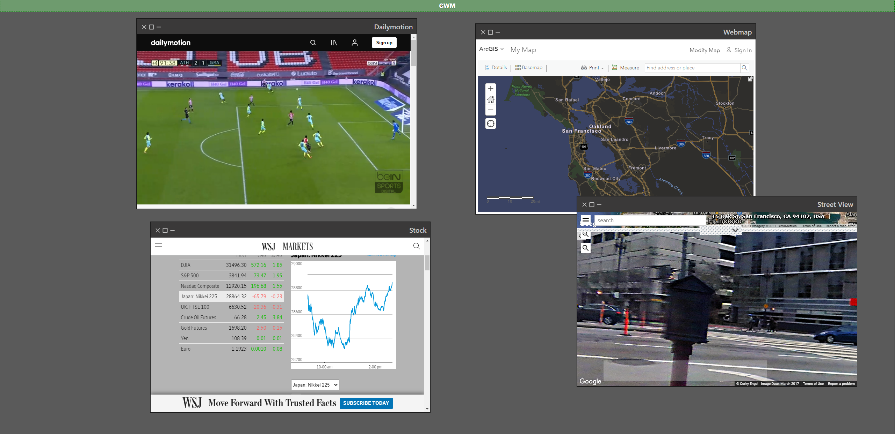

# global-widget-manager
Global Widget Manager (GWM) allows the users to show multiple displays served locally or on the web.
GWM also supports React components; allowing users to add their render components directly to the widget manager.



## Features
* Add widgets based on their URL.
* Add widgets as React components.

## Planned
* Local (browser) storage for all the user configurations.
* Support for database storage.
* Inter-widget communication using Javascript events.
* User management and authentication.
* User autherization and widget access levels.
* Remote, OS-level, application UI rendering as a widget.

## Install

```
npm install
```

## Run
```
npm run
```


## Add Widgets

### Using Url
#### In Code
Simply use the `updateWindow` method passing in `id`, `title`, and `url`. Ensure that `id` is unique.
#### In browser
After running the widget, use the `Add Widget` widget to add new widget providiing `id`, `title`, and `url` as text input. Ensure that `id` is unique. NOTE: This currently does not persist on refresh or restart.

### Using React Component
```
    <Window initTitle={title}
        id={id}
        initWidth={width}
        ref={setRef(id)}
        initHeight={height}
        clickCallback={clickCallback}>

        <Your_Components_Here><Your_Components_Here/>

    </Window>
```

`id`: Unique id of window/widget

`title`: Title of the widget shown to the user

`initHeight`: initial height of widget

`initWidth`: initial width of widget

`ref`: Unique forwarded reference (required for window ordering). Recommneded to use dynamic ref. Refer to `const [getRef, setRef] =  useDynamicRefs()` in WidgetManager

`clickCallback`: Callback when window is clicked. Useful for window view reordering. Refer to `clickCallback(id)` in WidgetManager
