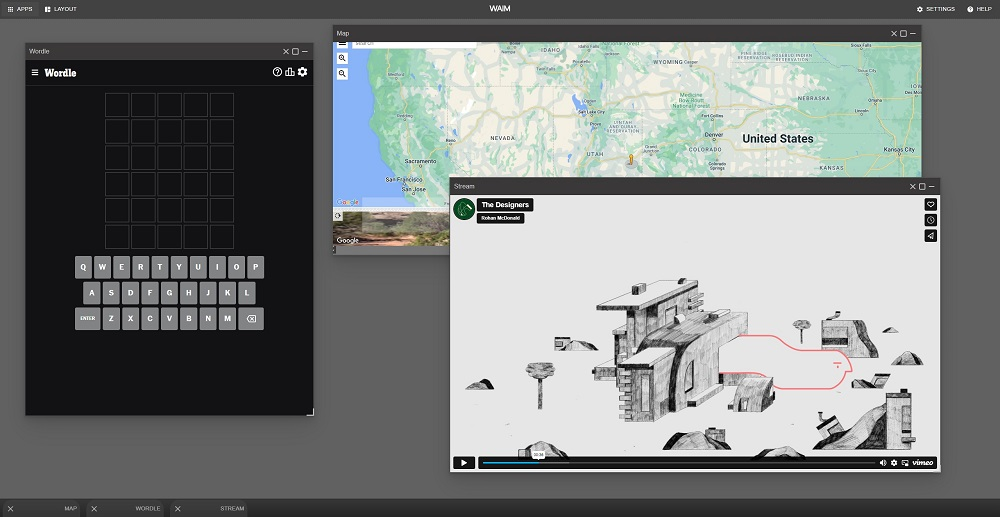

# webapp-interface-manager


Web Application Inteface Manager (WAIM) allows the users to show multiple displays served locally or on the web.
WAIM also supports React components; allowing users to add their render components directly to the app manager.



## Features
* Add pre-built apps from the host by providing a URL.
* Add apps as React components.
* Multiple instances from a single UI base.
* App-to-app communication using JavaScript events.
* Local (browser) storage of all apps and configurations.
* Window resizing
* Maxmize and minimize apps.
* Easy to build, modify, and redeploy.

## Planned
* Support for database storage.
* User management and authentication.
* User autherization and app access levels.


## Support

### Supported Browsers:
* **FireFox (v87+)**
* **Chrome (v89+)**
* **MS Edge (v89+)**

### Supported OS
*
* **Windows 10**
* **Ubuntu 18.04**
* **Ubuntu 20.04**

**NOTE**: Minimal/initial support for mobile devices and Safari web browsers.

## Install

```
npm install
```

## Run
```
npm run dev
```


## Add Web Apps

### StaticWindow and Constants

StaticWindow requires an `appid` field. `appid` referrences the `src/constants.js` to retrieve information about the app.
For each new app in `src/constants.js`, provide:

* `appid`: key of the new object and the `appid` field. Must be unique otherwise it overrides an existing app.

* `title`: title of the app. Shown to the user in the menus and at the bottom and top bars.

* `width`: width of the window that displays the url or React component.

* `height`: height of the window that displays the url or React component.

* (OPTIONAL) `url`: url of the page to be displayed. If React components are used, leave this empty.

* (OPTIONAL) `single`: true or false; whether the manager can spawn a single instance or multiple instance of the app. `false` by default

* (OPTIONAL) `deletable`: true or false; whether the user can delete the app. `false` by default.

### As URL to a page

#### In Code
Using `src/constants.js` to add your pre-built UI endpoint and URL.

Example:
Change `src/constants.js` to include your new app
```js
export const BUILT_IN_APPS = {
    .
    ..
    ...
    mynewapp: {
        appid: "mynewapp",
        title: "My New App",
        width: 800,
        height: 600,
        url: "http://mywebsite.com"
    },
}
```


#### In browser
After running WAIM, navigate to the top left and open `Add New Web App` window to add new app providing `appid`, `title`, `url`, `width`, `height`, `deletable`, and `single` from the UI selection.

The `Add Web App` React component uses the the built in messaging system and hooks into `window.waim.messageHandler` to publish an object to the `__create_new_app__` channel containing the object below:
```js
{
    id: sting,
    title: string,
    width: number,
    height: number,
    url: string,
    single: true|false,
    deletable: true|false,
    editable: true|false
}
```

WAIM will respond with the appid and a status object on the `__create_new_app_response__` channel in the following format:
```js
{
    id: string,
    status: "success"|"failure"
}
```

### As a React Component

1. Change `src/constants.js` to include your new app
```js
export const BUILT_IN_APPS = {
    .
    ..
    ...
    mynewapp: {
        appid: "mynewapp",
        title: "My New App",
        width: 800,
        height: 600
    },
}
```
2. Add your app component to the DOM list in the `AppManager.js` useEffect
```js
{/* Add all static apps below */}
addAppDom("mynewapp", <MyNewAppComponent/>)
```

## Modify

### Header
* Change `WAIM` to any text or image in `src/main/Header.js`.
* Change the header green background in `src/css/App.css`. Refer to `.header` class.

### Footer
* Change the footer colors in `src/css/App.css`. Refer to class `.footer`.
* Change the minimize bar in `src/main/MinBar.js`
* Change the minimize bar colors in `src/css/App.css`. Refer to `.min-bar`, `.min-bar-close` and `.min-bar-title` classes.

### Window
* Change the window structure and buttons from `src/main/Window.js`
* Change the window layout and colors from `src/css/App.css`. Refer to `.window`.

## Messaging

* Each application can attempt to access a version of `messageHandler` to subscribe and publish to channels.

* To grab the instance, use `window.waim.messageHandler`, which contains 2 functions:
    * `publish("channelName", data)`
    * `listen("channelName", callback)`. In this instance, `callback` is a function that contains 1 parameter: the data sent by the publisher.
* Applications residing on a different domain (as iframes) will not be able to use this feature.
* Application pre-built and residing on the same domain as the server (no CORS issues) can access the waim messaging framework after the webpage is loaded on `window.waim.messageHandler`


### Built in Channel
1. `__create_notification__`: Use this channel to show a framework wide notification.
```js
{
    message: string,
    type: "info"|"error"|"warning"|"success",
    duration: number -> miliseconds
}
```

2. `__create_new_app__`: Use this channel to create new apps from other WAIM apps.
```js
{
    id: sting,
    title: string,
    width: number,
    height: number,
    url: string,
    single: true|false,
    deletable: true|false,
    editable: true|false
}
```

3. `__create_new_app_response__`: Use this channel to receive a response on an app creation request.
```js
{
    id: string,
    status: "success"|"failure"
}
```

## Build

Run the command
```
npm run build
```
This will generate a directory named `build`. The `build` directory will contain the newly generate WAIM; with all the custom configurations from `src/constants.js` and all your custom React components. 

## Try
Try out the latest release:
[https://masesk.github.io/webapp-interface-manager](https://masesk.github.io/webapp-interface-manager)

